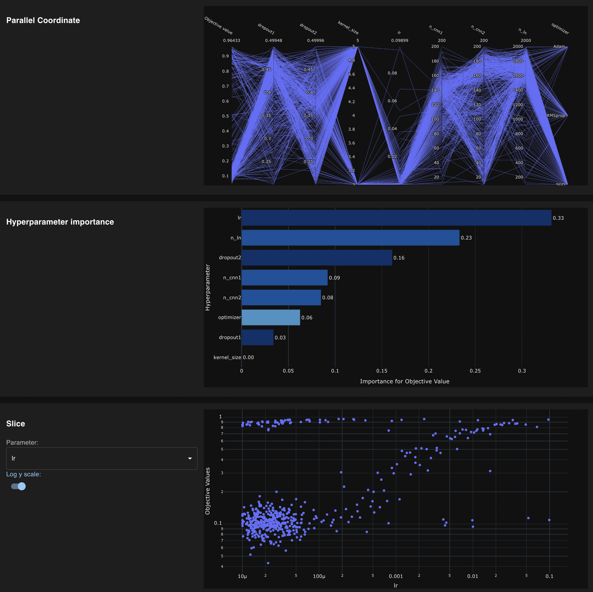
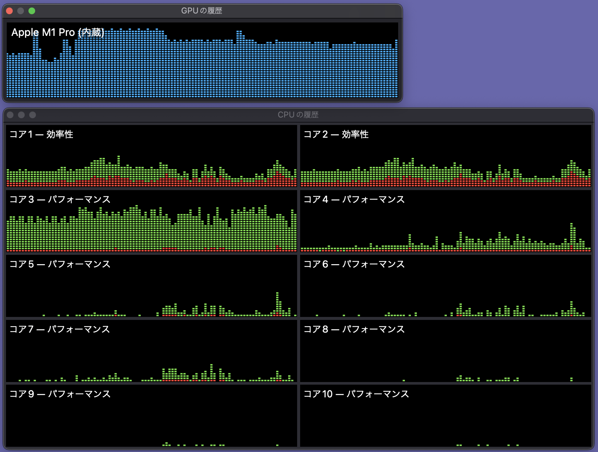

# PyTorch, MNIST, Optuna

## これは？

[Optuna](https://www.preferred.jp/ja/projects/optuna/)から。

> オープンソースのハイパーパラメータ自動最適化フレームワークOptuna™は、ハイパーパラメータの値に関する試行錯誤を自動化し、
> 優れた性能を発揮するハイパーパラメータの値を自動的に発見します。オープンソースの深層学習フレームワークChainerをはじめ、
> 様々な機械学習ソフトウェアと一緒に使用することが可能です。


- SQLiteをサポートしていて、最適化の続きの実行、別プロセスで並列実行ができる。（別マシンの場合はちゃんとしたDBを使おう）
- 枝刈りが素晴らしい！ ダメなら途中でやめるし、よさそうな所は絨毯爆撃します。
- [optuna-dashboard](https://github.com/optuna/optuna-dashboard)で手軽に進捗確認できます。


## 最適化の実行

[pytorch_simple.py](https://github.com/optuna/optuna-examples/blob/main/pytorch/pytorch_simple.py)を改造。


```
sh 00train.sh
```


## optuna-dashboard

mnist_cnn.py の結果です。SGDのlrが最も精度に寄与してるって。Dropoutもそれなりに。
・・・こんなの手動で試行した決定では導けないよな。




## Reference

- [Optuna](https://www.preferred.jp/ja/projects/optuna/)
- [optuna-examples](https://github.com/optuna/optuna-examples)
- [optuna-dashboard](https://github.com/optuna/optuna-dashboard)


## Pytorch on Apple Silicon Metal

次の Pytorch 1.12 には Metal 対応が入るみたい。素晴らしい！

これは[Pytorch v1.12.0-rc5](https://github.com/pytorch/pytorch)で実行です。



